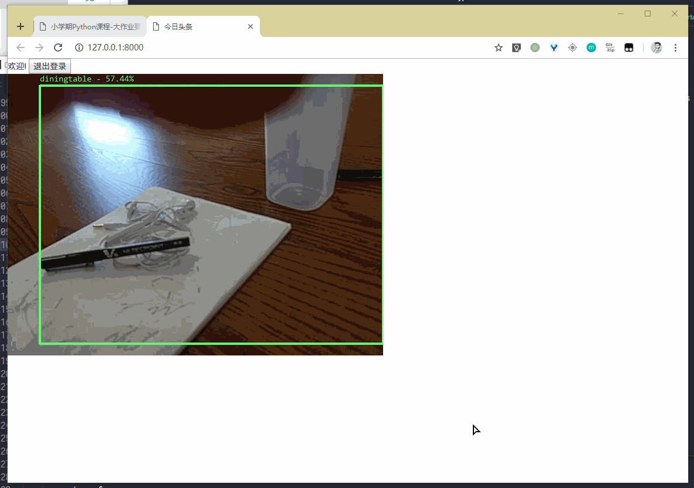

# Python 大作业说明文档

注：由于pdf不支持gif图片，所以文档直接以md格式提供

## 部署方式

系统由三部分组成：Redis 服务器、图像收集与处理的程序（Camera.py）、网站系统。

### 安装依赖项

1. python package

   requirements.txt中列出了

2. **darkflow** 在 extra 文件夹下可以找到 darkflow 的压缩包，解压之，在解压后的目录中运行 `pip install .`

3. **Redis 服务器**  可以前往[此处](https://github.com/MicrosoftArchive/redis/releases)下载redis服务器并安装。请保持默认端口号6379不变 。

### 开启摄像头

摄像头所在的文件是 Camera.py，在开启的情况下需要填入三个参数：摄像头提供图片的模式、摄像头来源以及处理方式。

- **摄像头提供图片的模式**：可选值 `queue` 与 `newest`。默认情况下 opencv 使用的摄像头会有一个 buffer，因此调用 read 的时候不一定读到的是最新的帧。如果使用 `queue` 参数，可以保证视频的连续性，但是无法保证实时性；如果使用 `newest` 参数，总会取出最新的帧，这样会保证实时性，但是视频连续性较差。

- **摄像头来源**：可填 `local` 或者一个 url，如果使用 `local` 将会开启电脑的摄像头，如果使用填写 url 会从网络读取摄像头。一个合法的 url 形如 `http://192.168.137.110:8080/video`，支持 HTTP/RTSP。

  （下面的文档中使用的是 HTTP 连接的摄像头，在 extra 文件夹下有一个 apk 文件，安装后即可让 Android 手机成为一个摄像头并 host 其它程序到它的 HTTP 连接，可以通过在电脑上开一个热点，手机连上去再使用这个应用来使用手机采集视频。）

- **处理方式**：一共有五种模式可以选择：
  - `abs_motion`：运动物体检测，会标记出处于异常位置的物体。异常与正常是针对第一帧而言的，第一帧所有的物体处于正常位置上。
  - `rel_motion`：运动物体检测，会标记出处于运动中的物体。
  - `darknet`：基于 darknet 的物体类型检测。这个速度比较慢。
  - `ssd_obj`：基于 mobile ssd 的物体类型检测。
  - `obj_tracker`：物体标记与追踪，实际使用中效果不是很好，不一定触发得了。

如果你希望直接开始，使用这组参数：

```shell
python Camera.py newest local ssd_obj
```

### 开启 Django

进入 web 目录，执行 `python manage.py runserver`。

### 打开网站查看效果

进入 `http://localhost:8000` 然后登录。你可以直接使用管理员账号登录，目前的管理员账号为 root，密码为 123456。

登录后，你应该可以看到正在显示的视频以及与之相关的分析。


## 实现完成情况概览

- 部署方式以及运行截图见上，附其它模式的运行截图：
  - 相对运动检测（`rel_motion`）：
  - 绝对运动检测（`abs_motion`）：
  - Darknet（`darknet`，运行较慢）：
  - 物体追踪（`obj_tracker`，以 id 方式标记出记录的独特对象，貌似只能针对人脸）：

- 搭建了网站服务

- 多用户服务，可以修改密码

- 管理员可以添加账户

- 用户权限鉴别， 只有登录的用户才能看到摄像头画面

- 用setinterval刷图片的src属性来更新图片达到视频的效果

- Python 读取摄像头支持 RTSP；

- 为了做到进程间高效率通讯，我们采用redis数据库，把数据放在内存中，加速读取（比用文件来通讯快很多）

- 运动物体检测未使用深度学习技术，是普通的计算机视觉技术。物体打标和检测属于深度学习技术。

- 分析任务完成了初级版（`ssd_obj`），中级版（`rel_motion`）和高级版（`obj_tracker`）。

## 使用的第三方库

- redis-py：Andy McCurdy（与社区），MIT，提供适用于 Python 的访问 Redis 的接口；
- python-redis-lock：Ionel Cristian Mărieș（与社区），BSD，提供适用于 Python 的 Redis 的锁；
- scipy：社区，多个开源协议混合，Python 科学计算包；
- numpy：社区，多个开源协议混合，Python 数值计算包；
- opencv-python：社区，MIT，Python 计算机视觉包；
- darkflow：Trieu（与社区），GNU GPLv3，DarkNet 的 TensorFlow 移植版本；
- Pillow：Alex Clark（与社区），MIT-like，Python 图像处理包；
- imutils：Adrian Rosebrock（与社区），MIT，简化 Python 图像相关的一些操作；
- Django：社区，BSD，Python Web 服务框架；

此外还有来自 https://www.pyimagesearch.com/ 的一些代码，开发者是 Adrian Rosebrock，无授权协议：

- [Basic motion detection and tracking with Python and OpenCV](https://www.pyimagesearch.com/2015/05/25/basic-motion-detection-and-tracking-with-python-and-opencv/)：物体运动检测
- [Basic motion detection and tracking with Python and OpenCV](https://www.pyimagesearch.com/2018/07/23/simple-object-tracking-with-opencv/)：简单的物体追踪
- [Real-time object detection with deep learning and OpenCV](https://www.pyimagesearch.com/2017/09/18/real-time-object-detection-with-deep-learning-and-opencv/)：实时物体分类